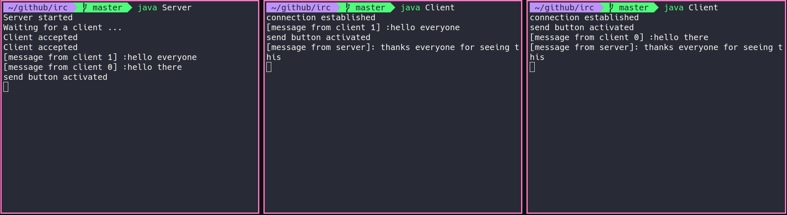
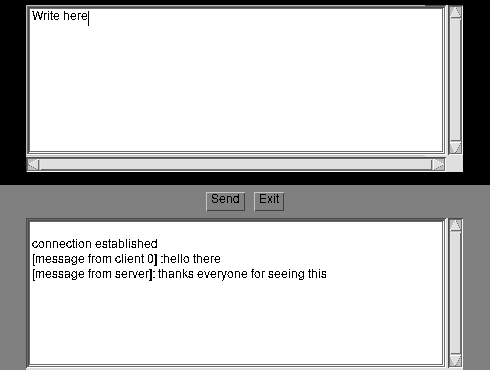
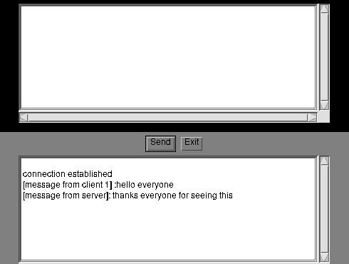
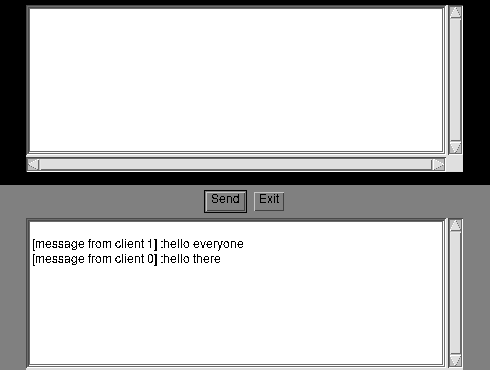

# Internet Relay Chat using java sockets

## presentation

this is a simple internet chat app using java. It also has a Graphical User Interface.
that supports multiple clients. and users can write using terminal or with the gui



  

<hr>


<hr>




## setup 

```bash
https://github.com/Bechir-Brahem/irc/
cd irc
javac *.java
java Server
# and then in another terminal
java Client
```


